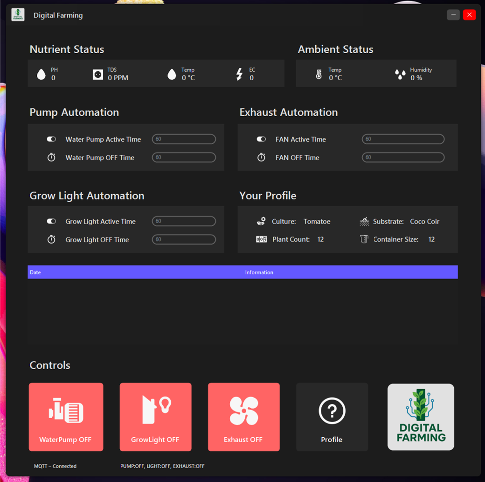
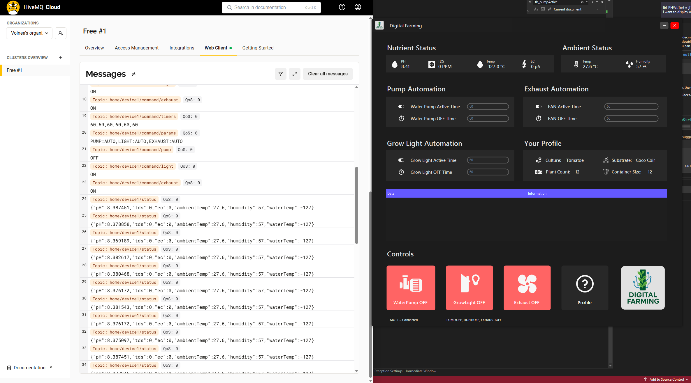
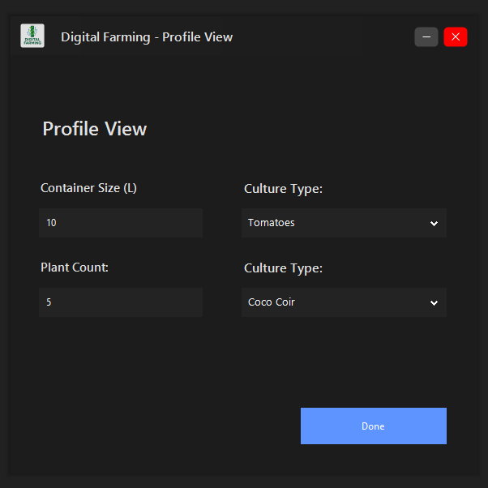

# 🌱 Digital Farming — Hydroponics Management System

  

**Digital Farming** is a C# based application for monitoring, controlling, and optimizing hydroponic farm setups. Designed to help growers automate processes, collect data, and make better decisions.

---

## ✨ Features

- Real-time sensor monitoring (e.g. pH, EC, temperature, humidity, etc)  
- Automated actuation (pumps, lighting, vents)  
- Data logging and trend graphs  
- Alerts / thresholds (e.g. when readings exceed safe bounds)  
- Manual override and control interface  

---

## 🧱 Architecture & Tech Stack

| Layer / Component         | Technology / Tools                                                        |
|---------------------------|---------------------------------------------------------------------------|
| Core                      | C# (.NET 8)                                                               |
| UI                        | Winforms                                                                  |
| Sensor Communication      | MQTT (through HiveMQ)                                                     |
| Microcontroller           | ESP32                                                                     |

---

## 🧰 Prerequisites

Before running the application, make sure you have:

- Visual Studio Installed 
- Arduino IDE  
- Sensor hardware & controller  
- HiveMQ Account   

---

## 🧰 Hardware

Hardware that I used in the project:

- Water Pump ( 800L/h 5m, DC 12V )
- ESP32 - ( Must Have )
- TDS Meter V1.0 ( Mmgoqqt 3.3v ) - Must Have
- Liquid PH 0-14 Value Detection Regulator Sensor Module - Black Probe - Must Have
- HiveMQ Account   
- Wi-Fi for PC and Tower (can be separate)

---

## 📸 Screenshots

User Interface - Dashboard

Communication between MQTT and Digital Farming

Profile view - You can get custom instructions for each plant type.

